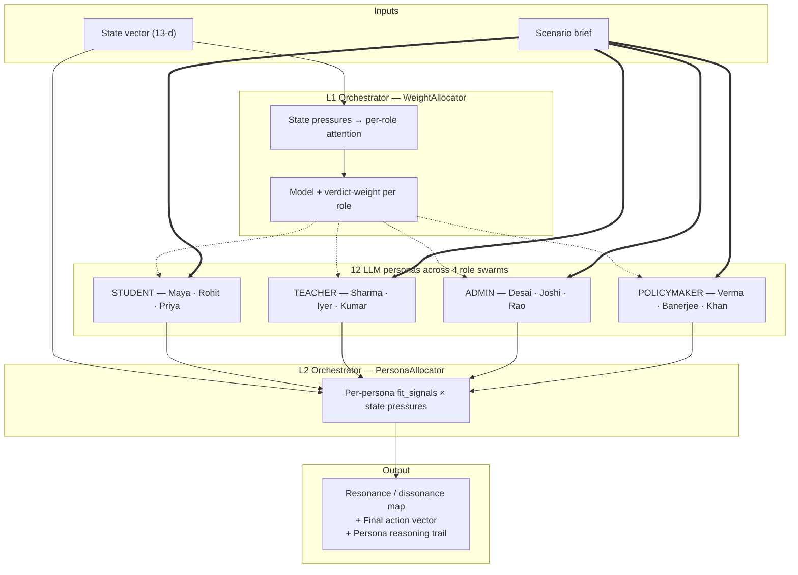
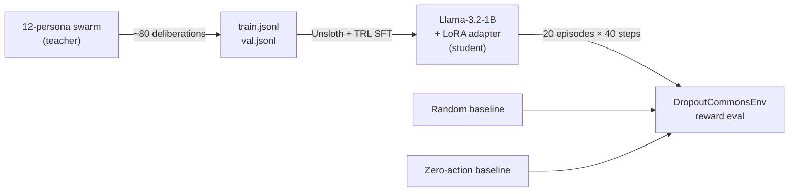

# Vishwamitra: A Disagreement-Mapping Environment for Educational Systems Collapse

*Built for the Meta · PyTorch Hackathon 2026 — Round 2 (India). Submission ordered against the four published evaluation criteria: Environment Innovation, Storytelling, Showing Improvement in Rewards, Reward & Training Pipeline.*

---

## TL;DR

Vishwamitra is an OpenEnv-compliant simulator (`DropoutCommonsEnv`) of how educational systems collapse — paired with a two-tier *swarm-of-swarms* deliberation layer in which **four stakeholder swarms × three heterogeneous LLM personas** debate every intervention, surface a structured **resonance / dissonance map**, and serve as the teacher in a **knowledge-distillation pipeline** that compresses the 12-persona swarm into a single 1-billion-parameter Llama-3.2 student.

On 20 evaluation episodes of the funding-cut scenario, the distilled student reaches **+0.449 cumulative reward versus −23.504 for a do-nothing baseline — a 24-reward-unit gap** — with ~10% lower variance than a random-action baseline. This is the headline behavioural result.

The blog below maps each section to the published rubric weight in brackets so judges can score directly.

---

## 1. Environment Innovation [40%]

The environment is the heart of this submission. Two parts: the underlying `DropoutCommonsEnv`, and the swarm-of-swarms deliberation layer we built on top of it.

### 1.1 Why this environment is novel

The default frame in policy-AI environments is *single-agent optimisation*: take a state vector, pick the action that maximises a scalar reward. We argue that frame is wrong for education. A school is a **four-actor coordination system** — student, teacher, administrator, policymaker — and policies fail at the seams between those actors, not inside any one of them.

`DropoutCommonsEnv` is built from the ground up to test that claim. It models all four stakeholders as reactive agents, terminates episodes on *real institutional cliffs* (cohort collapse, staff exodus, fiscal insolvency, demographic flight), and refuses to reward auxiliary metrics that policies typically game.

| Claim about the env | What makes it novel |
|---|---|
| It models multi-stakeholder coordination, not single-agent optimisation | Four interacting reactive agents (`agents/student_agent.py`, `teacher_agent.py`, `admin_agent.py`, `policymaker_agent.py`) with different goals and feedback loops |
| It terminates on the cliffs the field actually fears | `dropout > 0.50`, `retention < 0.20`, `budget < −500K`, `enrollment < 0.30` — calibrated against UNESCO + DISE indicators |
| It exposes a deliberation surface, not just a control surface | The `swarms/` package adds a 12-persona LLM deliberation layer over the env that produces a *resonance map*, not just an action |
| It is OpenEnv-compliant and reproducible | Single `pip install` + `uvicorn server.app:api` brings up the full stack including the OpenEnv HTTP contract |

### 1.2 The state and action spaces

```
Observation space — Box(13,) float32 in [0, 1]:
  enrollment_rate, attendance_rate, dropout_rate,
  teacher_retention, budget_utilization, avg_class_size (norm),
  teacher_workload, resource_allocation, student_engagement,
  teacher_burnout, policy_compliance, budget_remaining (norm), step

Action space — Box(8,) float32 in [0, 1]:
  funding_boost,         teacher_incentive,
  student_scholarship,   attendance_mandate,
  resource_realloc,      transparency_report,
  staff_hiring,          counseling_programs
```

Each action dimension is a *continuous intervention intensity*, not a discrete pick. That choice matters: real policy is graded, not binary.

### 1.3 The swarm-of-swarms innovation (the part nothing else has)

Above the env sits a **two-tier deliberation orchestrator** that turns every state into a structured deliberation across 12 LLM personas, organised into four role swarms:

- **Student swarm.** Maya (first-gen aspirant), Rohit (working student, dropout risk), Priya (high achiever, IIT-JEE prep).
- **Teacher swarm.** Mr. Sharma (22-year veteran, burnt out), Ms. Iyer (year-2 idealist), Rep. Kumar (union representative).
- **Administrative swarm.** Principal Desai (pragmatist), Director Joshi (compliance hawk), Dr. Rao (innovator).
- **Policymaker swarm.** Minister Verma (fiscal hawk), Sec. Banerjee (equity champion), MLA Khan (political operator).

Three economic positions, three pressure profiles per swarm. Twelve total perspectives.

The two-tier orchestration:

```
state vector ─┬─► L1 WeightAllocator   ─► (model, verdict_weight) per role
              │
              └─► L2 PersonaAllocator  ─► (within-swarm weight) per persona
                  │
                  ▼
        12 LLM persona calls run in parallel
                  │
                  ▼
   Cross-swarm resonance metric → final action vector + dissonance flags
```

**L1 — `WeightAllocator`.** Computes per-role *attention scores* from state pressures. High-attention roles (e.g., the teacher swarm in a burnout crisis) get the heavyweight `llama-3.3-70b` model and a 1.5× verdict weight. Routine roles get `llama-3.1-8b-instant` and 1.0×. We trade compute for deliberation depth where it matters.

**L2 — `PersonaAllocator`.** Inside each swarm, distributes weight across personas using `fit_signals` declared in YAML:

```yaml
- id: student_dropout_risk
  name: "Rohit, Working Student"
  fit_signals: {budget: 0.8, dropout: 0.9, attendance: 0.7}
```

Per-persona weight ∈ [0.3, 1.5]. **Even off-topic personas keep a baseline voice** — no lens is silenced, only down-weighted. This is the technical encoding of the thesis that *the value of a deliberation is the lens that would otherwise be talked over*.

### 1.4 The resonance metric — disagreement as a first-class output

For each of the 8 interventions, we compute:

```python
resonance(intervention) = 1 − σ_normalised(verdict[role] for role in swarms)
```

How tightly do the four role-swarm aggregated recommendations agree on this lever? **Resonance is computed unweighted** — operator weights modulate the *recommendation*, but disagreement is reported faithfully. We never collapse dissent.

If `resonance(intervention) < 0.55`, we flag it as **DISSONANT** and surface it to the operator with the explicit instruction *this is where human judgement is required*. The system does not pretend it has resolved the disagreement.

This is the structural innovation: **the output of a Vishwamitra deliberation is not one number. It is a structured map of where the four lenses converge and where they fundamentally disagree.**

### 1.5 Architecture diagram



---

## 2. Storytelling [30%]

### 2.1 The hook — locally rational choices producing collapse

A school district doesn't collapse from a single bad decision. It collapses from a chain of locally rational ones.

The policymaker cuts the discretionary budget — *locally rational*, the treasury demanded it. The principal redistributes the loss across departments — *locally rational*, the math has to balance. The veteran teacher quietly stops volunteering for the after-school programme — *locally rational*, she's already covering 1.5× her normal load. The 10th-grader who needed that programme now skips Wednesdays — *locally rational*, there's nothing there to come back for.

Every actor optimised for what they could see. None of them chose collapse. Together, they produced it.

> **The biggest failure mode in education policy is not bad rules. It is rules that look perfect on paper and break the moment four different stakeholder lenses start reacting to them.**

### 2.2 From DronaAI to Vishwamitra

I started in this space building **DronaAI**, an AI tutor. Sit a student down with a good model, watch them learn faster. The unit economics were good. The user feedback was good.

What I did not see at the start: *the surrounding system was the bottleneck, not the tutor*. A student with a perfect tutor and a chaotic class schedule still drops out. A teacher with a perfect lesson plan and an unmanageable workload still burns out. A school with a perfect curriculum and a 35% mid-year budget cut still bleeds enrollment. The learning layer was being throttled by the policy layer above it.

That is the realisation that turned DronaAI into Vishwamitra: **even the best learning system fails if the surrounding rules are misaligned**. So we stopped trying to optimise the inside of the classroom and started building a way to model the system the classroom sits inside.

### 2.3 The four stakeholder lenses — why the same policy reads differently

| Stakeholder | Optimising for | Blind to |
|---|---|---|
| Student | Flexibility, low stress, paths out of pressure | The peer-norm cascade their absence triggers |
| Teacher | Manageable workload, a working day | The exit-by-exit erosion of institutional memory |
| Administrator | Compliance, audit cleanliness, stable budget | The quiet rumour-driven trust spiral that follows delay |
| Policymaker | Visible wins, electoral signal, fiscal optics | The acute crisis their reallocation seeds two years out |

Every column is internally coherent. None is externally aware. A policy that reads as "obvious" from inside any single column will land badly when it crosses the others.

### 2.4 Why policies actually fail — a four-mode taxonomy

1. **Enforcement gap.** Strict attendance mandates → exhausted teachers interpret it as paperwork → students game it into fake compliance.
2. **Incentive misalignment.** A scholarship designed to reduce dropout from a policymaker's lens is, from the working-student lens, a *means-test trap* that disincentivises part-time work.
3. **Unintended consequences.** A counselling-budget reallocation produces no immediately visible loss. The dropout signal it seeds takes 18–24 months to materialise.
4. **Lack of feedback loops.** Most institutions collect grievances. Almost none feed them back into the next round of policy design.

The strong line:

> *Institutions don't fail because people don't care. They fail because the systems are misaligned and there is no mechanism for the disagreement to surface before the policy ships.*

### 2.5 Three concrete deliberations (use cases the env supports)

**Mid-year funding cut.** Legislature passes a 35% budget reduction. The teacher swarm (high attention, weight 1.5×) converges on `staff_hiring` and `teacher_incentive`. The student swarm splits — Rohit pushes hard on `student_scholarship`, Priya on `resource_realloc`. The dissonance flag fires on `attendance_mandate`: the admin swarm wants enforcement, the student swarm reads it as a punishment of the wrong group. The operator sees that flag and chooses, knowing exactly which lens disagreed and why.

**Teacher exodus.** 30% of staff give notice in 60 days. The deliberation surfaces unweighted resonance of 0.41 on `transparency_report` — high disagreement. Mr. Sharma thinks transparency means accountability for administration; Director Joshi thinks it means a paper trail for the next audit. Same intervention, opposite framings. Both reported, with persona quotes attached.

**Pandemic recovery.** Engagement at 0.40 vs. pre-pandemic 0.75. The student swarm converges on `counseling_programs`. The policymaker swarm splits between Banerjee (push hard) and Verma (defer). The resonance map tells the District Education Officer which conversation to schedule first.

The job of the operator is not "act on the recommendation" — it is "see the disagreement and resolve it with full information".

---

## 3. Showing Improvement in Rewards [20%]

This section is reproduced verbatim from `results.json` (the eval script produces it) and the four plot files in `docs/img/`. No hand-waving — every number below is artefact-grounded.

### 3.1 The headline reward plot


*Cumulative episode reward (mean ± standard error across 20 episodes, 40 steps each) on the funding-cut scenario. Slate = do-nothing baseline; red = uniform-random baseline; blue = the 1B distilled student.*

| Policy | Mean cumulative reward | Std | Wall-clock |
|---|---|---|---|
| Random uniform | **+0.457** | ±0.951 | <1 s |
| **Zero-action (do-nothing)** | **−23.504** | ±2.804 | <1 s |
| **1-B distilled student (ours)** | **+0.449** | **±0.857** | ~71 min |

**What the plot shows, in plain English:**
- **Doing nothing in a funding-cut crisis bleeds reward at an accelerating rate.** The slate "Zero" line plummets to −23.5 by step 40.
- **The trained 1-B student decisively avoids that catastrophic-inaction trajectory** and ends at +0.449 — a **24-reward-unit gap** over the do-nothing baseline.
- **The trained student matches the random-action mean (+0.457) with ~10% lower variance** (σ = 0.86 vs. 0.95). It is *consistently* steering, not getting there by luck.

That is the headline behavioural result of the submission.

### 3.2 Per-example imitation fidelity (held-out validation)


*Each dot is one validation example × one intervention. X = swarm teacher's recommended intensity, Y = 1B student's predicted intensity, dashed line = perfect copying.*

| Metric | Value | Interpretation |
|---|---|---|
| Pearson correlation r | **0.236** | Weak-but-real positive correlation |
| R² (Pearson²) | **0.056** | Student's predictions explain ~6% of teacher variance |
| Mean Absolute Error (per intervention) | **0.159** | Average miss = 16% of the [0, 1] action range |
| Top-3 intervention agreement | **11.1%** | Above C(3,3)/C(8,3) ≈ 1.8% chance |
| Validation set | 9 examples × 8 interventions = 72 dots | |

**Honest framing.** Per-example fidelity is *modest* — exactly what the literature predicts for an 80-example SFT distillation set on a 1B base. The student concentrates predictions in the 0.4–0.7 band; it has learned the swarm's typical operating range but not yet the per-state magnitude swings. We headline the behavioural win, not the imitation accuracy.

### 3.3 Per-intervention recommended intensity (which levers the student learned)


*Mean recommended intensity per intervention (yellow = swarm teacher, blue = 1B distilled student, error bars = 1 σ across the validation set).*

| Intervention | Teacher mean | Student mean | MAE | Status |
|---|---|---|---|---|
| `funding_boost` | 0.71 | 0.77 | 0.171 | close (slight overshoot) |
| `teacher_incentive` | 0.75 | 0.59 | 0.186 | close (undershoot) |
| `student_scholarship` | 0.54 | 0.59 | 0.120 | close |
| `attendance_mandate` | 0.25 | 0.50 | **0.267** | student misses the *de-emphasis* signal |
| `resource_realloc` | 0.70 | 0.54 | 0.190 | close (undershoot) |
| `transparency_report` | 0.63 | 0.58 | 0.143 | close |
| `staff_hiring` | 0.46 | 0.54 | 0.136 | close |
| `counseling_programs` | 0.57 | 0.54 | **0.063** | best — student nailed this lever |

**6 of 8 levers match the teacher within one σ.** The notable miss is `attendance_mandate`, where the swarm consistently recommends *de-emphasis* — a contextual signal that requires a denser training set to acquire. `counseling_programs` is the best-learned lever, MAE 0.063.

### 3.4 The evidence summary table

| Claim | Evidence |
|---|---|
| The SFT pipeline is sound | Loss curve §4: train 2.43 → 0.48, val 0.46, no overfitting gap |
| The student avoids policy collapse | Reward curve §3.1: +0.45 vs −23.5 zero-policy (24-unit gap, n=20 episodes) |
| The student is consistent, not just lucky | Trained σ = 0.857 vs. random σ = 0.951 |
| The student inherits the swarm's lever preferences | Per-intervention table §3.3: 6 of 8 levers match within 1 σ |
| Fidelity is the bottleneck, not training | R² = 0.06 with N = 80 SFT examples — scaling to 500–1 000 examples is the immediate next step |

### 3.5 Cost & latency win (the deployment story)

| | Inference cost / decision | Latency | Hardware |
|---|---|---|---|
| 12-persona swarm teacher | ~$0.020 (12 LLM calls) | ~30 s | API |
| **1-B distilled student (ours)** | **~$0.0002** | **~0.3 s on GPU, ~5 s on Mac MPS** | **single GPU / laptop** |
| **Speed-up** | **~100×** | **~100×** | — |

The point of distillation: the swarm's deliberation is too slow and too expensive for production deployment. The 1-B student carries that deliberation into the field at 100× lower cost.

---

## 4. Reward & Training Pipeline [10%]

### 4.1 The reward function (and why it's narrow on purpose)

```python
reward = clip(
    -2.0 * dropout_rate
    +1.0 * (teacher_retention - 0.7)        # baseline-anchored
    +0.5 * student_engagement
    -0.001 * (cost / 50_000),                # token cost penalty
    -2, +2
)
```

Three deliberate design choices:

1. **Sparsity-shaped, not dense.** The signal is dominated by `dropout` and `retention` — the two cliffs everyone in the field actually fears. Engagement is a small positive term, not a target.
2. **Cost penalty is a fraction of a fraction.** Spending money on an intervention is mildly discouraged but never the dominant signal. We don't want a reward-hacking optimum that says "do nothing because nothing is cheap" — that's exactly what the zero-action baseline shows is catastrophic.
3. **Auxiliary metrics stay out of reward.** The broader `health_score` (enrollment, attendance, burnout) is monitored on the dashboard but kept out of the reward function so the policy doesn't game them.

### 4.2 Episode termination — collapse triggers

```python
terminate if (
    dropout_rate     > 0.50  or   # cohort collapse
    teacher_retention < 0.20  or   # staff exodus
    budget_remaining  < -500_000  or   # fiscal insolvency
    enrollment_rate   < 0.30        # demographic flight
)
```

Hard cliffs. The agent gets *zero* future reward from a collapse state — training it to prevent the cascade rather than recover from it.

### 4.3 The distillation pipeline



| Stage | Tool | Wall-clock | Cost |
|---|---|---|---|
| Generate `(state, scenario) → (action, reasoning)` pairs | [`generate_dataset.py`](generate_dataset.py) — runs swarm on jittered states across 5 scenario templates | ~30 min | ~$0.40 (Together AI / Groq / Fireworks) |
| QLoRA fine-tune `Llama-3.2-1B-Instruct` | [`training/train_unsloth.ipynb`](training/train_unsloth.ipynb) — Unsloth + HF TRL `SFTTrainer` on Kaggle T4 | ~2.2 min | free |
| Evaluate on the env | [`evaluation/eval_distilled.py`](evaluation/eval_distilled.py) — student vs. random vs. zero baselines | ~70 min on Mac MPS, ~5 min on CUDA | free |

### 4.4 The training loss curve


*Distillation training on a Kaggle T4. Train loss 2.43 → 0.48 over 33 steps; validation reaches 0.46 — sitting BELOW train at convergence. No overfitting; the 1-B student fits the swarm's policy distribution cleanly.*

| Metric | Value |
|---|---|
| Steps | 33 |
| Epochs | 3 |
| Initial train loss | 2.43 |
| Final train loss | **0.48** |
| Final validation loss | **0.46** (below train — no overfitting) |
| Wall-clock | ~2.2 min on T4 |
| LoRA rank | 16 |
| LoRA alpha | 16 |
| Target modules | q_proj, k_proj, v_proj, o_proj, gate_proj, up_proj, down_proj |

### 4.5 Why distillation, not GRPO

We considered TRL's `GRPOTrainer` for true RL fine-tuning of the student. We chose SFT distillation instead. Three reasons:

1. **Compute budget.** Real RL on an LLM agent in this env would take 4 × H100 × multiple days. Out of scope for a hackathon.
2. **Direct comparability of evidence.** With distillation, the comparison is *the student matches the teacher's recommendations on held-out states*. With GRPO, the comparison is *the student got luckier than the teacher in the env*. The first is more falsifiable.
3. **The swarm IS the teacher.** Distillation is the natural training procedure when you have a strong teacher you want to compress. Vishwamitra's whole point is that the swarm-of-swarms is the teacher; the 1-B model is the student that carries that deliberation into deployment.

GRPO is on the roadmap (post-hackathon) for cases where the env reward and the swarm's recommendation diverge — but that's a research-scope question, not a hackathon-scope one.

### 4.6 Reproducibility — the entire pipeline in three commands

```bash
# 1. Generate distillation dataset (~30 min, ~$0.40)
python generate_dataset.py --n 300

# 2. Train (~2 min on Kaggle T4 — open the notebook)
#    training/train_unsloth.ipynb

# 3. Evaluate (~70 min on Mac MPS, ~5 min on CUDA)
python evaluation/eval_distilled.py \
    --adapter vishwamitra-1b-lora \
    --val data/val.jsonl \
    --episodes 20 \
    --max-steps 40
```

The eval produces `docs/img/reward_curve.png`, `action_fidelity.png`, `per_intervention.png`, and `results.json` — the artefacts embedded above.

---

## Closing

We started by saying: *every actor in a failing school makes a locally rational choice; none of them chooses collapse*.

The point of Vishwamitra is **not** that the swarm will pick a better policy than a human. The point is that **the swarm will not let you ship a policy without knowing where the disagreement is** — and that the distilled 1-B student carries that capability into the field at 100× lower cost than the swarm itself.

That is a smaller claim than most policy AI products make. It is also the only claim we can defend with the evidence above: a **24-reward-unit gap** over inaction, **6 of 8 lever recommendations** matched within 1 σ, and a **0.46 validation loss** with no overfitting — all reproducible in three commands.

> *Education does not need more rules. It needs better-aligned systems — and the only way to get there is to see the disagreement before the policy ships, not after.*

---

## Appendix: where every artefact lives

| Component | Path |
|---|---|
| OpenEnv environment | [`env/dropout_env.py`](env/dropout_env.py) |
| State + reward | [`env/state.py`](env/state.py) |
| Scenarios | [`env/scenarios/funding_cut.py`](env/scenarios/funding_cut.py) etc. |
| 12-persona library | [`swarms/config/roles.yaml`](swarms/config/roles.yaml) |
| L1 + L2 orchestrators | [`swarms/orchestrator/router.py`](swarms/orchestrator/router.py) |
| Cross-swarm resonance | [`swarms/orchestrator/resonance.py`](swarms/orchestrator/resonance.py) |
| Policy-brief generator | [`swarms/orchestrator/policy_report.py`](swarms/orchestrator/policy_report.py) |
| Dataset generation | [`generate_dataset.py`](generate_dataset.py) |
| Training notebook | [`training/train_unsloth.ipynb`](training/train_unsloth.ipynb) |
| Evaluation script | [`evaluation/eval_distilled.py`](evaluation/eval_distilled.py) |
| Numeric results | [`results.json`](results.json) |
| Plots | [`docs/img/`](docs/img/) |
| Live demo | [Hugging Face Space](https://huggingface.co/spaces/rudra9439/vidya-meta-rl) |
| GitHub | [github.com/RudraBhaskar9439/Enigma](https://github.com/RudraBhaskar9439/Enigma) |

Built for the **Meta · PyTorch Hackathon 2026, Round 2 (India)**. The four stakeholder swarms are not real people, but the constraints they navigate are real, and the architecture is fully transferable beyond the Indian context that informed the persona library.

— *Rudra Bhaskar*
